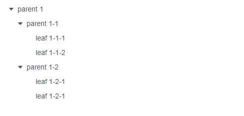
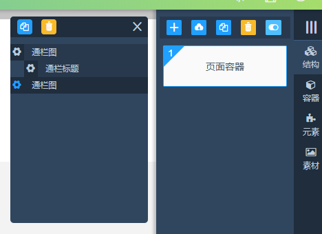
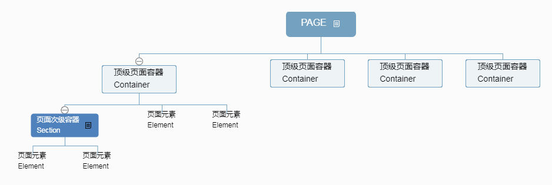

## 类树形结构的处理
### 背景
最近在处理页面编辑器-**编辑组件展示panel**时，碰到了树形结构的操作。起初，为了快速应用功能选定了一个第三方插件。类似于下图：  
  
应用后并不满足功能场景。只能自己开发定制符合功能的Tree插件。最终达到的效果如下：  
  
这里记录下开发tree组件的解决的问题。
### 遇到的问题
#### 组织Tree的数据结构
页面结构导图：

关键是转换为javascript数据结构。在数据结构这门课中，其中有一章是介绍树的，而页面组件树则可抽象为一种多叉树，即每个节点下都有可能包含多个子节点。最终得到JSON字符串为
```javascript
var treeData = [{
    label: 'Container',
    key: 'c0',
    content:[{
        label: 'Section',
        key: 's0',
        content:[{
            label: 'Element',
            key: 'e0'
        }]
    }
    ]
},{
    label: 'Container',
    key: 'c1',
    content:[{
        label: 'Section',
        key: 's1',
        content:[{
            label: 'Element',
            key: 'e1'
        }]
    },{
        label: 'Section',
        key: 's2',
        content:[{
            label: 'Element',
            key: 'e2'
        }]
    }]
},{
    label: 'Container',
    key: 'c2',
    content:[{
        label: 'Section',
        key: 's3',
        content:[{
            label: 'Element',
            key: 'e3'
        }]
    }]
}]
```
搞定了数据结构，接下来需要解决树的相关算法。
#### 数据遍历
##### 递归-深度优先
```javascript
function walkComs(component, callback){
    if(!component || component.length < 1){
        return false;
    }
    component.forEach(function(com, i){
        callback(com);
        var children = com.content;
        if(children && children.length > 0){
            walkComs(children, callback);
        }
    });
}
walkComs(treeData, function(com){
    console.log(com, '\n');
});
```
##### 循环-广度优先
```javascript
function walkComs2(component, callback){
    if(!component || component.length < 1){
        return false;
    }
    var stack = [];
    component.forEach(function(com, i){
        stack.push(com);
    });
    var tmp;
    while(stack.length){
        tmp = stack.shift();
        callback(tmp);
        var children = tmp.content;
        if(children && children.length > 0){
            stack = stack.concat(children);
        }
    }
}
walkComs2(treeData, function(com){
    console.log(com, '\n');
});
```
##### 循环-深度优先
```javascript
function walkComs3(component, callback){
    if(!component || component.length < 1){
        return false;
    }
    var stack = [];
    component.forEach(function(com, i){
        stack.push(com);
    });
    var tmp;
    while(stack.length){
        tmp = stack.shift();
        callback(tmp);
        var children = tmp.content;
        if(children && children.length > 0){
            stack = children.concat(stack);
        }
    }
}
walkComs3(treeData, function(com){
    console.log(com, '\n');
});
```
这三种遍历方法，非递归的性能要高于递归，做一个简单的测试。
分别打开以下三个文件，查看console输入台。
[递归](tree_re.html)  
[循环广度](tree_g.html)  
[循环深度](tree_d.html)
#### 获取元素
##### 获取指定元素
根据key获取指定元素。采用广度优先遍历查找指定的元素。
```javascript
function _getCom (coms, key){
    if(!coms || coms.length < 1){
        return false;
    }
    var stack = [];
    var com;
    coms.forEach((com, i) => {
        stack.push(com);
    });
    var tmp;
    while(stack.length){
        tmp = stack.shift();
        if(tmp.key === key){
            com = tmp;
            break;
        }
        var children = tmp.content;
        if(children && children.length > 0){
            stack = stack.concat(children);
        }
    }
    return com;
};
```
##### 获取指定元素父元素
对比获取指定元素，需要添加一个判断方法：判断子节点是否包含指定key，如果包含返回true，不包含返回false。
```javascript
function _getParentCom (coms, key) {
    if(!coms || coms.length < 1){
        return false;
    }

    let _isContain = (children, key) => {
        let eqr = children.some((com) => {
            if(com.key === key){
                return true;
            }
            return false;
        });
        return eqr;
    };

    var stack = [];
    var com;
    coms.forEach((com, i) => {
        stack.push(com);
    });
    var tmp;
    while(stack.length){
        tmp = stack.shift();
        var children = tmp.content;
        if(children && children.length > 0 && _isContain(children, key)){
            com = tmp;
            break;
        }
        if(children && children.length > 0){
            stack = stack.concat(children);
        }
    }
    return com;
};
```