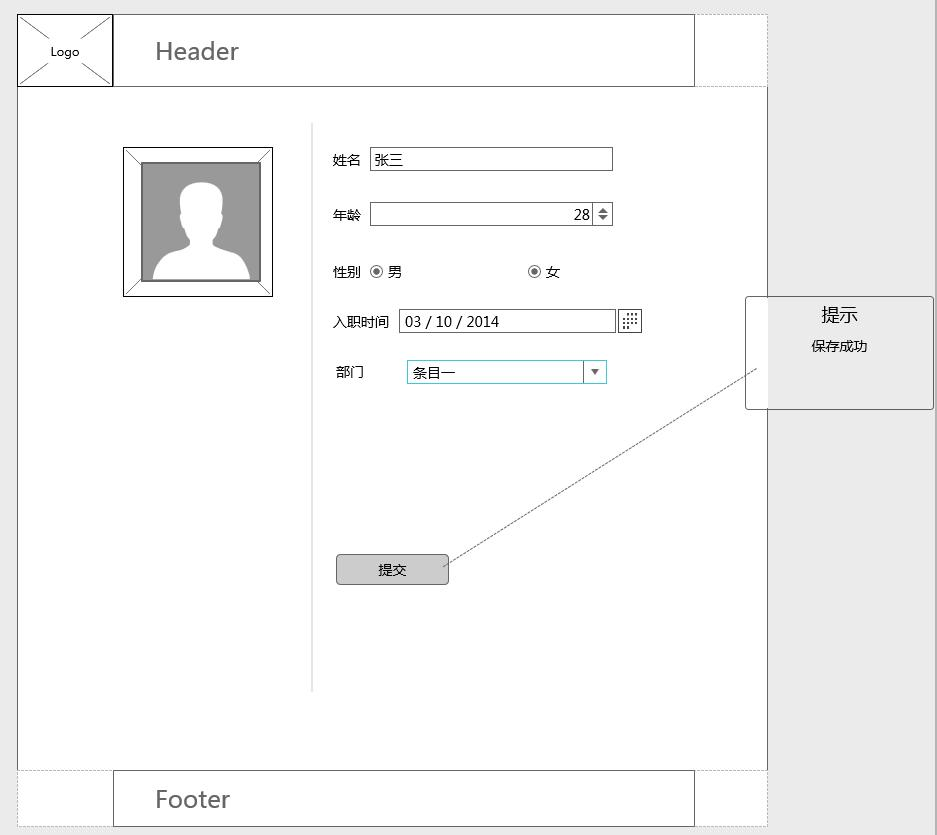
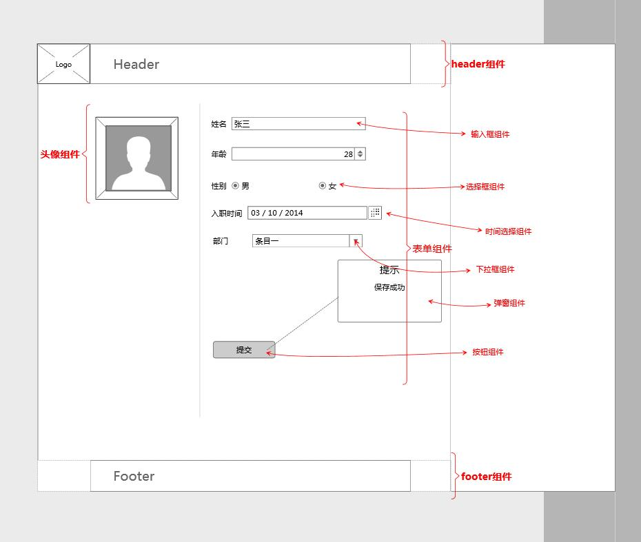
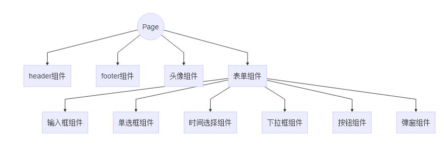

## 组件化 
### 背景  
一个项目越趋于开发稳定时，所考虑将会是什么？  
如何合理地开除CTO......  
&emsp;&emsp;玩笑了，往往考虑更多的是：如何提高开发效率？如何减少开发成本(开除CTO，不能降低成本？哈哈)？从制度来说，我们需要制定统一的标准，完善的开发流程；从技术来说，我们需要对资源构成，对技术进行重组。  
&emsp;&emsp;资源重组，主要是去除冗余，提取公共资源，建立公共资源库，也可以理解为建立基础服务，无论是图片、css、html片段、js工具代码；技术重组，主要淘汰不合适的技术、开发理念，采用更完善的构建流程，开发理念。  
&emsp;&emsp;无数的前端大牛已经在这条路上狂奔而去了。才有了现在前端领域各种形式的构建工具，层出不穷的解决方案，简单好用的前端框架。而组件化开发就是其中最重要的一环。像React、Vue都秉承了组件化的理念。  
组件化相对于后端开发，是早就存在的理念，而对于前端则不是。  
那么，前端的组件化开发是如何发展的？
### 前端组件化开发的发展
1. 静态页面时期
这是前端的开端，我们的页面多是静态页面，缺少那些令人着迷的交互。这时候的‘组件化’，或许叫做分治更为合适。即开发者将HTML、css、js创建为单独文件，减少内嵌的写法。
2. 早期的动态页面时期
有过后端开发经验的会更了解这个时期，为了满足更丰富的数据交互，出现了诸如JSP、ASP、PHP的后端渲染的技术。虽然，使页面活了起来但是页面也充满了繁杂的业务逻辑。
3. 后端taglib兴起
这时的组件化是以taglib形式存在的，是由后端服务实现的。通过将HTML/css/js以及业务逻辑打包为一个标签，再通过动态引入标签来实现的。这时Web应用开发是重后端轻前端的。
4. Ajax时期
Ajax出现为前后端的分离带来的可行性，使前端能承担越来越多的业务逻辑。而这时的jQuery、easyUI、extjsUI等框架/工具的盛行，为了开发人员提供了越来越多的组件。开发人员可以在可选范围内，随组合使用的这些组件。
5. MV\*盛行时期
随着前端开发转向以数据模型为中心开发，DOM操作已作为附加，MV*理念开始在前端实现。Vue、Angular、React的出现使自定义组件更加灵活，伴随着Node、bower包管理工具的出现，使组件传播使用更加容易。

&emsp;&emsp;css具有全局的特性，避免样式冲突、层级繁长、难以阅读一直是要解决的痛点。最初，我们按页面结构或者业务逻辑提取出公共的样式，来管理CSS样式，但是仍然没有解决掉CSS的痛点，直到LESS/SASS出现才改变了这一现状，但这也并没有解决CSS的痛点。 

那么，到底什么是组件化呢？  
### 组件化
现在我们需要实现如下页面：
   

一般情况下，我会这样做: 
1. 页面布局
2. 页面元素样式
3. 添加页面交互
4. 添加ajax请求，与后端联调

非常简单的开发思路。但如果是组件化去开发，则是要将页面划分为一个个功能模块，即划分组件。
  
像DOM树一样，组件化的页面会形成一个组件树。
```
graph TD
a((Page)) --> b[header组件]
a --> c[footer组件]
a --> d[头像组件]
a --> e[表单组件]
e --> f[输入框组件]
e --> g[单选框组件]
e --> h[时间选择组件]
e --> i[下拉框组件]
e --> j[按钮组件]
e --> k[弹窗组件] 
```

然后，我们在分别去实现每一个组件，再由页面引入所有组件，在访问页面时能够成功将组件渲染为所需要的。  
那么，理解组件化的关键就是-组件。

#### 组件
引用下百科的定义:  
> 组件是对数据和方法的简单封装。

组件本质就是封装，功能代码的封装。在面向对象理念中，封装是为了‘高内聚、低耦合’。组件之于前端，应该是UI层与数据交互的封装。一个例子：
```
<!-- UI层 -->
<style type="text/css">
    div{
        margin: 0 auto;
        width: 200px;
        padding: 20px 0;
        text-align: center;
        background-color: #f0f;
    }
    .num {
        display: block;
        width: 100%;
    }
</style>
<div>
    <input type="text" name="text" id="text">
    <span class="num" id="num">0个字符</span>
</div>
<!-- 数据交互 -->
<script type="text/javascript">
    var num = 0;
    var $input = document.getElementById('text');
    var $num = document.getElementById('num');
    $input.addEventListener('input', function(e){
        var target = e.target;
        var val = target.value;
        var l = val.length;
        $num.innerHTML = l + '个字符';
    }, false);
</script>
```
这可以算是一个简陋的‘组件’，它实现了自动计算输入字符长度的功能。它拥有自己的UI、数据、数据逻辑。这个‘组件’还基本只算是某个功能单元的集合了，连封装都没有......  
然后，无数大牛开始探索研究，各种各样的组件化方案、框架被提出，W3C就在这时提出了Web Components标准。虽然它因为自身的局限性并为取得很好的成效。我们仍然可以从中借鉴经验。

#### Web Components标准
Web Components定位是可供用户重复利用的组件接口，而且它是浏览器的一部分。不同于用javascript代码作为组件的生成管理工具，我们可以直接在浏览器中使用它。它是有四项技术构成的：custome element、HTML templates、Shadow DOM、HTML Imports。
##### 1. Custom Element 自定义元素
让我们像使用原生HTML标签一样，使用自定义的元素标签。元素标签要求是语义化，知标签而知其功能。例如，<datepicker>则就代表着时间选择器组件标签。     
*注：现在官方API已经升级为ES6的模式，为了方便这里仍采用ES5模式*
```javascript
//继承HTMLElement，使自定义标签具备原生标签的基本能力
var cInput = Object.create(HTMLElement.prototype);

//回调方法，插入自定义表签的实际内容
cInput.createdCallback = function(){
    //创建独立作用域
    var shadow = this.createShadowRoot();

    //TODO
    var dom = document.createElement('div');
    
    shadow.appendChild(dom);
};
    
//注册自定义标签
var CInput =  document.registerElement('c-input', {
    prototype: cInput
});
```
##### 2. HTML template 页面模板
这是WebComponents定义的原生模板能力，不同于模板工具库，它真的很原始，没有那些额外的渲染能力。
```html
<template id="cInnputTmpl">
    //特别纯粹的原生模板
    <div class="cInput">
        <input type="text" name="text" id="text">
        <span class="num" id="num">0个字符</span>
    </div>
</template>
```
template标签内就是我们组件所需要的UI模板，需要的时候只需：**xxx.innerHTML = document.getELementById('cInputTmpl').innerHTML**。如果你要做页面随数据的动态更新，那么请自力更生。

##### 3. Shadow DOM 独立HTML片段
Shadow Dom 就是将html、css隔离开来，有自己的作用域，内部独立不受影响。
```javascript
//创建独立作用域
var shadow = this.createShadowRoot();

//TODO
var dom = document.createElement('div');

shadow.appendChild(dom);
```
非常简单调用**createShadowRoot**方法即可。生成shadow可以向DOM节点那样添加内容。
##### 4. HTML Imports 组件依赖引用
有了组件，还需要解决页面如何引用组件。
```html
<link rel="import" href="cinput.html">
```
以上就是WebComponents所涉及的四项技术。现在对WebComponents的支持并不好，它并不能真正应用到项目开发中，我们更多的是从中借鉴组件创建的理念。  
Web Components提出了该如何实现组件，它确定了组件应该是————通过一种标准化的非入侵的方式封装一个组件。表明了组件所具备的特性：
1. ‘高度内聚，低耦合’————组件应该是高内聚，只负责本身所提供的功能，不依赖与其他组件
2. ‘拥有自己的作用域’————拥有自己独立的作用域，不会出现全局冲突
3. ‘自定义元素标签’————组件的使用方式应该是如同使用HTML标签一样便捷
4. ‘组件之间可相互通讯’————多个组件组合成了完整页面，每个组件即独立又相关关联
5. ‘定义规范化’————有统一的标准实现组件，便于使用何管理  

也定义了组件基本的表现形式：
1. 自定义标签
2. 页面模板
3. 独立的作用域
4. 组件依赖-引用、通讯

### 所谓的组件化
&emsp;&emsp;了解完了什么是组件、组件的官方标准，再来思考什么是组件化。  
&emsp;&emsp;归根结底是要弄清楚：**为什么要组件化**。其实是前端承担的功能越来越繁杂，开发的复杂度越来越高，传统的开发模式无法满足现状，为了改善开发效率低、维护成本高、困难的团队协作而必然出现的解决方案。    
&emsp;&emsp;面对越来越复杂的前端项目，改一处而动全身的痛处，我们希望可以将项目分解，分解成互不干扰的小部分，独立开发，独立维护，而它们直接又可以随意组合。这种由繁到简的思想，体现到前端就是组件化。
&emsp;&emsp;组件化对于技术人员来说，是为了代码的松耦合，为了团队的相互协作，是一次技术的总结，经验的积累。总的来说，是以开发更有效率，代码更易维护扩展为目的；而对于一个项目，一个产品来说，则是利润的追逐，为了减少成本，提高开发效率。   
&emsp;&emsp;组件化是前端技术发展必然经历的一个阶段。

