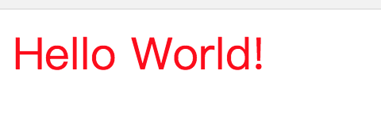
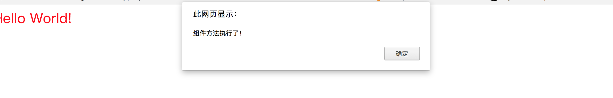

## 组件实现和组件化开发
接上篇[组件化](COMPONENTS.md)，现在聊聊如何实现组件和组件化开发。
### 组件设计思想和实现
Web Components还未成熟，不能很好的应用到实际项目中(*angular2称已全面拥抱，暂时还未了解*)。我们仍面临着-实现组件，这一问题。那么，抛开Web Components的四项技术，我们仍可遵循Web Components标准去实现更符合现在前端领域的组件实现方案。而在前端大牛们的努力下，为我们提供了多种组件的实现方案和框架。  
1. React Components
2. Vue Components
3. Angular Directives
4. Ember Components
5. Backbone Components 
......  

暂时不去考虑这些优秀的框架实现，我们尝试自己思考下如何去实现组件。  
前端组件有一点特殊的地方：javascript是组件的组织者，它控制并组织组件的相关内容。然而，组件的渲染又必须等待html的加载渲染，只有加载渲染之后javascript才能大显身手。所以，我们首先要解决组件如何挂载到HTML页面中。  
可以想到两种方法：1. 直接由javascript创建DOM节点添加到页面中，这需要等待DOM加载完毕。 2. 从HTML标签入手，以自定义标签的渲染为入口。  

通过上一篇文章，阐述了组件的表现形式：以自定义标签为入口，javascript为组织控制，HTML、css为外在表现层。所以选择第二种方法。  
组件应该包含：
1. 自定义标签
2. UI模板(HTML、css)
3. 核心逻辑（javascript）  

那么，我们首先要解决自定义标签问题：自定义标签被加载时，触发核心的javascript。  

> 先看下作为示例组件的需求：一个包含input输入框的div，输入框输入不同颜色可改变div背景色。以下代码将实现此示例组件。

#### 创建自定义标签
看如下代码：  
```javascript
<c-div style="color:red;font-size:28px;">Hello World!</c-div>
```
运行结果如下：

HTML解析器没有对<c-tag>报错，一切都很和谐。说明浏览器对待非规范的自定义元素，就像对待标准元素一样，只是没有默认的行为和样式，这是HTML5标准所要求的。  

稍微深入了解下。我们都知道浏览器提供HTMLElement对象，所有规范的DOM节点都是它的实例。同样的，为了保留自定义元素浏览器又提供了HTMLUnknownElement对象，非规范的DOM节点同时继承了HTMLUnknownElement与HTMLElement。然后，在运行如下代码：
```javascript
<c-div id="c" style="color:red;font-size:28px;">Hello World!</c-div>
<script>
var n = document.getElementById('c');
console.log(n instanceof HTMLElement);//true
console.log(n instanceof HTMLUnknownElement);//false
</script>
```
结果是：true、false。你会发现并不是上面所说的同时继承了这两个对象。这是为什么呢？因为，浏览器对拥有合法元素名的自定义元素，将会自动继承HTMLElement。在运行如下代码查看结果：
```javascript
<cdiv id="c" style="color:red;font-size:28px;">Hello World!</cdiv>
<script>
var n = document.getElementById('c');
console.log(n instanceof HTMLElement);//true
console.log(n instanceof HTMLUnknownElement);//true
</script>
```
*注：以上几个例子对浏览器有一定要求，IE8(包括)以下结果是不同的。*  

也就是**合法元素名**是由**’-‘**连接的语义化标签名，如**c-div**。那么，我们自定义标签命名就依照这种形式。  

在回归主题，既然浏览器对自定义标签的渲染能很好的兼容，那么我们可以把它看为一个普通的DOM节点进行操作。这样我们找到了通过自定义标签触发javascript核心代码的方法：  
**DOM操作**——自定义标签的切入点，通过将nodeName关联javascript方法。如下：  
```javascript
<c-div id="cDiv"></c-div>
<script>
    var cdiv = function(){
        alert('组件方法执行了！');
    };
    document.addEventListener('DOMContentLoaded', function(){
        var cD = document.getElementById('cDiv');
        var cNode = cD.nodeName;
        var comFn = cNode.replace(/\-/g, '').toLowerCase();
        window[comFn]();
    }, false);
</script>
```

运行结果拿到了自定义标签的nodeName,如此就可以从nodeName入手关联到javascript函数，执行方法。但是，加入存在多个自定义标签呢？一个个取得DOM，获取nodeName。。。。。。我们可以为所有组件提供统一的父容器，并保证整个页面只存在一个父容器。如下：

```javascript
<div class="app" id="app">
    <c-div id="cDiv"></c-div>
</div>
<script>
    var cdiv = function(){
        alert('执行了c-div自定义标签');
    };
    document.addEventListener('DOMContentLoaded', function(){
        var app = document.getElementById('app');
        var childNodes = app.children;
        for(var i=0;i<childNodes.length;i++){
            var cNode = childNodes[i].nodeName;
            console.log(cNode);
            var comFn = cNode.replace(/\-/g, '').toLowerCase();
            console.log(typeof window[comFn]);
            (typeof window[comFn] === 'function') && window[comFn]();
        }
    }, false);
</script>
```
运行结果调用的了对应的组件方法。至此，我们完成自定义标签作为切入点的功能。然后，我们继续优化一下代码，创建独立命名空间，隔离单独作用域。
#### 初始化组件
#### 组件UI渲染
#### 核心业务逻辑

### 组件化的开发
### 核心——组件引擎
组件引擎
#### 组件引擎做什么
#### 实现引擎-组件描述
#### 实现引擎-组件加载
#### 实现引擎-组件更新
#### 实现引擎-组件销毁
#### 借鉴Vue