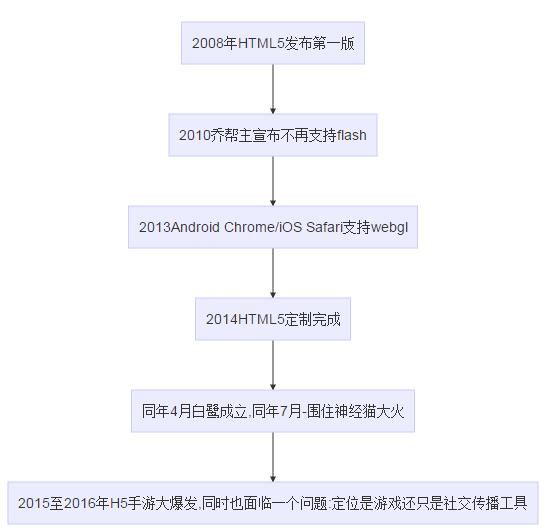

## 关于H5游戏  
### H5游戏的发展  
一个个人观点：H5不是HTML5，也不能代表HTML5;HTML5是最新一代的超文本标记语言的标准，而H5只不过是应用了HTML5与CSS3新特性。
```
graph TD
    a[2008年HTML5发布第一版] --> b[2010乔帮主宣布不再支持flash]
    b --> c[2013Android Chrome/iOS Safari支持webgl]
    c --> d[2014定制完成]
    d --> e[同年4月白鹭成立,同年7月-围住神经猫大火]
    f --> g[2015至2016年H5手游大爆发,同时也面临一个问题:定位是游戏还只是社交传播工具]
```
  
现今，H5发展方向：中、重度手游化。
### H5小游戏的特点  
关于H5小游戏，它是作为社交传播工具出现的。它具备了即开即玩的特点，以‘低成本、低门槛、简单有趣、易于分享’而被开发人员热衷。
而现在，H5正在尽力摆脱小游戏的桎梏，向中、重度手游转化。
### H5小游戏的世界构成  
每一个H5小游戏都有着同样的世界构成，无论是原生开发还是使用游戏引擎开发。我们可以简单的把他分为：世界、舞台、相机。   
* 世界：最顶层的容器，承载着游戏内容。舞台在于它之内，可通过改变相机位置，转变舞台展示的内容。
* 舞台：所看到的游戏画面，它小于或等于世界的大小。
* 相机：用来呈现舞台，可改变位移。

举例：一个游戏场景，游戏人物随地图走动，展示不同的地图风景。
### H5小游戏的生命周期  
小游戏的生命周期：
```
graph LR
    id1((访问页面)) --> a
    a[资源加载-加载] --> b[游戏开端-开始]
    b --> c[游戏主体-play]
    c --> d[游戏结束-end]
    d --再玩一次--> c
    d --再玩一次--> b
```


重新开始有两种方式：回到游戏主体；回到游戏开端。一般都会采取第一种方法。
### H5小游戏的适配  
适配，永恒的话题。小游戏尤其要确保游戏内容的合理展示。
首先，确定视觉稿的尺寸，按照现在750*1334比例即可。

  

按照视觉稿，将其分为背景、视觉挂件、交互对象，它们是按照z轴纵深排布的。需要确保的是必须保证交互对象的完全显示，其它部位可进行取舍。所以，必须保证交互对象的区域必须是能保证在合理的显示区域内。
